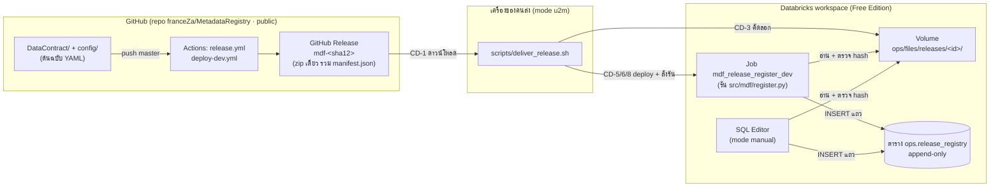
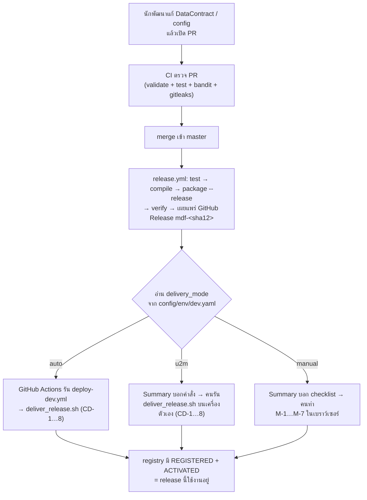
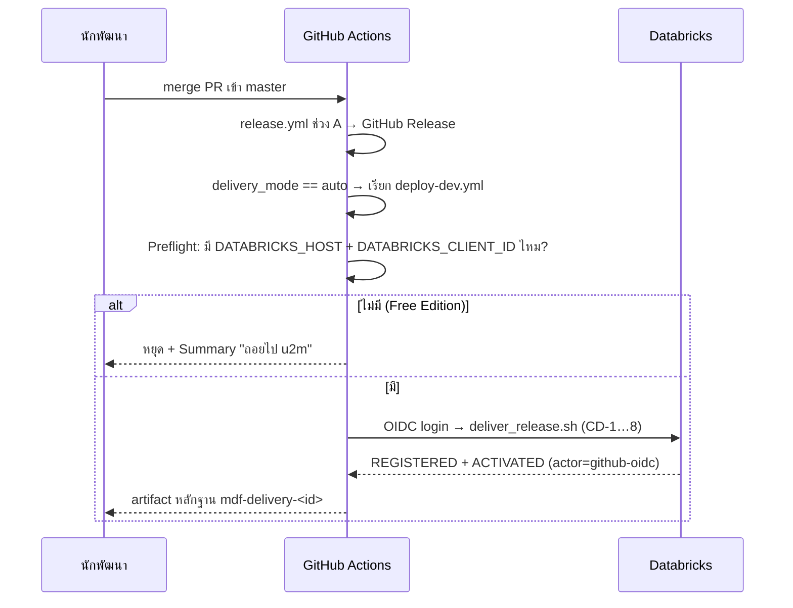
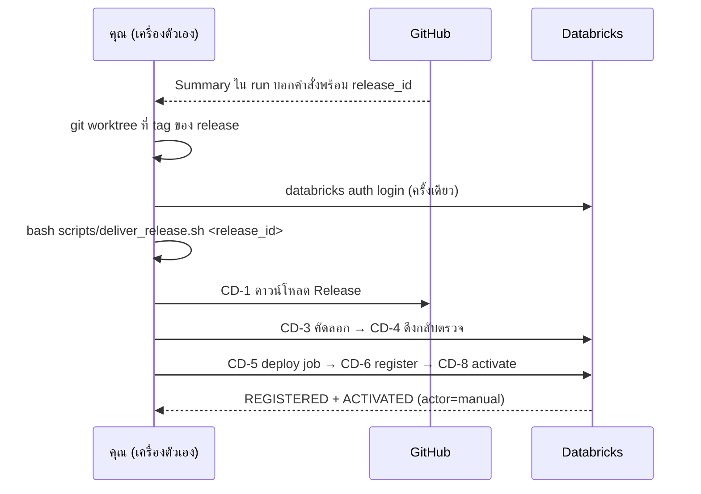

# คู่มือระบบส่ง release ไป Databricks — สำหรับคนที่มารับงานต่อ

> อ่านไฟล์นี้ก่อน เพื่อเข้าใจว่าระบบทำงานอย่างไรและทำไมถึงออกแบบแบบนี้
> ถ้าจะ "ลงมือส่ง release" ให้ใช้ checklist สั้น ๆ ใน [`release-delivery.md`](release-delivery.md) แทน
>
> ขอบเขต: Phase 2 (Epic E6) · ใช้กับ Databricks Free Edition · catalog `dev_catalog`

---

## 1. ระบบนี้ทำอะไร (อ่านย่อหน้าเดียวพอ)

ทีมเขียน Data Contract (ไฟล์ YAML) ไว้ใน Git เครื่องมือ `mdf` แปลงไฟล์เหล่านั้นเป็น **config ที่พร้อมใช้** (ไฟล์ JSON ชื่อ `*.resolved.json`) ระบบนี้มีหน้าที่เดียว คือ **เอา config ชุดที่ผ่านการตรวจแล้ว ไปวางไว้ใน Databricks แบบที่ไม่มีใครแอบแก้ได้ แล้วจดไว้ว่าชุดไหนคือชุดที่ใช้งานอยู่** เพื่อให้ job ประมวลผลข้อมูลใน Phase 3 หยิบ config ชุดที่ถูกต้องไปใช้เสมอ

ระบบนี้ **ไม่ได้** รันข้อมูลจริง ไม่ได้สร้างตาราง bronze/silver และไม่ได้เรียก job ประมวลผลข้อมูล (ทั้งหมดนั้นเป็นงาน Phase 3)

---

## 2. คำศัพท์ที่ต้องรู้ก่อน

| คำ | ความหมาย | ตัวอย่าง |
|---|---|---|
| **release_id** | ชื่อของ release หนึ่งชุด = `mdf-` + 12 ตัวแรกของ commit SHA บน `master` · 1 commit = 1 release | `mdf-d3ea0d559e04` |
| **package** | โฟลเดอร์ของ release หนึ่งชุด: ไฟล์ resolved (`*.resolved.json`) แยกเป็นโฟลเดอร์ย่อยตาม source (`<source>/*.resolved.json`) + `manifest.json` + `validation-report.json` ที่ราก | `build/dev/release/` |
| **manifest.json** | "ใบกำกับสินค้า" ของ package: บอก `release_id`, commit, และ **sha256 ของทุกไฟล์** ถ้าไฟล์ไหนถูกแก้แม้ 1 byte hash จะไม่ตรง | — |
| **manifest_sha256** | hash ของไฟล์ `manifest.json` เอง ใช้เป็น "ลายนิ้วมือ" ของทั้ง release | `e871519b7400…` |
| **GitHub Release** | ที่เก็บ package ต้นฉบับ บน GitHub (หน้า Releases ของ repo) | — |
| **Volume** | ที่เก็บไฟล์ใน Databricks · release อยู่ที่ `/Volumes/dev_catalog/ops/files/releases/<release_id>/` | — |
| **sealed** | โฟลเดอร์ release ใน Volume ที่ **มี `manifest.json` แล้ว** ถือว่า "ปิดผนึก" ห้ามแก้อีก | — |
| **registry** | ตาราง `dev_catalog.ops.release_registry` · สมุดบันทึกว่า release ไหนตรวจแล้ว และตัวไหนใช้งานอยู่ · **เพิ่มแถวได้อย่างเดียว แก้/ลบไม่ได้** | — |
| **REGISTERED** | แถวใน registry ที่บอกว่า "release นี้ถูกตรวจใน workspace แล้ว ของครบ hash ตรง" | — |
| **ACTIVATED** | แถวใน registry ที่บอกว่า "ตั้งแต่เวลานี้ release นี้คือตัวที่ใช้งาน" | — |
| **active release** | release ของแถว ACTIVATED **ล่าสุด** (ดูจาก `event_ts`) | — |
| **delivery_mode** | วิธีส่ง release ไป Databricks · ตั้งใน `config/env/dev.yaml` · มี 3 ค่า: `auto`, `u2m`, `manual` | `u2m` |

---

## 3. สถาปัตยกรรม — มีชิ้นส่วนอะไรบ้าง และอยู่ที่ไหน



### ชิ้นส่วนแต่ละตัว

| ชิ้นส่วน | ไฟล์ใน repo | หน้าที่ |
|---|---|---|
| ตัวสร้าง package | `src/mdf/package.py` (`mdf package`, `mdf verify-package`) | สร้างไฟล์ resolved ต่อ source + manifest · ตรวจว่า hash ครบ/ตรง/ไม่มีไฟล์เกิน |
| Workflow ออก release | `.github/workflows/release.yml` | ทุก push master → ทดสอบ → สร้าง package → เผยแพร่ GitHub Release → แสดง "ขั้นต่อไป" ตาม mode |
| Workflow ส่งอัตโนมัติ | `.github/workflows/deploy-dev.yml` | ใช้เฉพาะ mode `auto` · เรียก `deliver_release.sh` บน GitHub runner |
| สคริปต์ส่งของ | `scripts/deliver_release.sh` | ทำ CD-1…CD-8 · **ตัวเดียว** ใช้ทั้ง mode `auto` และ `u2m` |
| ตัวบอกขั้นต่อไป | `scripts/next_steps.py` | พิมพ์ขั้นตอนของแต่ละ mode พร้อมใส่ `release_id` จริงให้ |
| Job ลงทะเบียน | `databricks.yml` + `resources/release.job.yml` + `src/mdf/register.py` | รันใน workspace · ตรวจไฟล์ใน Volume แล้ว INSERT แถว REGISTERED/ACTIVATED |
| SQL ของ mode manual | `sql/manual/register_release.sql`, `sql/manual/activate_release.sql` | ทำหน้าที่เดียวกับ job แต่รันใน SQL Editor ได้เลย ไม่ต้องมี CLI |
| สร้างตาราง/Volume ครั้งแรก | `sql/bootstrap/ops.sql` | สร้าง schema `ops`, Volume `files`, ตาราง registry (รันซ้ำได้ ไม่มีผล) |
| ตัวเลือก mode | `config/env/dev.yaml` → `delivery_mode:` | สวิตช์ตัวเดียวที่บอกว่า release จะถูกส่งแบบไหน |

---

## 4. ภาพรวมการทำงานตั้งแต่ต้นจนจบ

ทุก mode มี **ช่วง A** เหมือนกัน ต่างกันแค่ **ช่วง B** (ใครเป็นคนส่ง)



**ช่วง A ทำงานเองทั้งหมด** ไม่ต้องมีใครกดอะไร ผลของช่วง A คือ GitHub Release หนึ่งชุด และข้อความ **"ขั้นต่อไป"** ในหน้า run ของ workflow (เข้าไปที่ GitHub → Actions → run **Release (push master)** → job **Publish GitHub Release** → ส่วน Summary)

---

## 5. เปรียบเทียบ 3 mode

| | `auto` | `u2m` (ค่าตั้งต้น) | `manual` |
|---|---|---|---|
| **ใครกดส่ง** | GitHub Actions ส่งเองหลัง merge | คนรันสคริปต์บนเครื่องตัวเอง | คนทำเองทุกขั้นในเบราว์เซอร์ |
| **login Databricks แบบไหน** | GitHub OIDC → service principal (ไม่มีรหัสผ่านเก็บไว้) | คน login ด้วย `databricks auth login` (OAuth U2M) | คน login หน้าเว็บ Databricks ตามปกติ |
| **ต้องติดตั้งอะไร** | ไม่ต้อง | `databricks` CLI, `gh`, `uv`, bash | ไม่ต้อง (มีแค่เบราว์เซอร์) |
| **ใช้ได้บน Free Edition ไหม** | ❌ ไม่ได้ (Free Edition ไม่มี account console ให้ตั้ง federation) | ✅ ได้ | ✅ ได้ |
| **ส่วนที่รันจริง** | `deploy-dev.yml` → `deliver_release.sh` | `deliver_release.sh` | `sql/manual/*.sql` |
| **ค่า `actor` ในตาราง registry** | `github-oidc` | `manual` (หมายถึง "คนรันสคริปต์เอง") | `manual-ui` |
| **ใช้เมื่อไร** | ย้ายไป workspace ที่ไม่ใช่ Free Edition และตั้ง federation แล้ว | งานปกติบน Free Edition | ติดตั้ง CLI ไม่ได้ / login CLI ไม่ผ่าน / เครื่องไม่มี bash |
| **พิสูจน์บนของจริงแล้ว** | ⚠️ พิสูจน์แค่ว่าหยุดที่ preflight ถูกต้อง · ยังไม่เคยส่งของจริง | ✅ | ✅ |

> ⚠️ ระวังชื่อ: ค่า `actor = manual` มาจาก mode **u2m** (สคริปต์ตั้งเองเมื่อไม่ได้รันบน GitHub) ส่วน mode **manual** จะได้ `manual-ui` ถ้าจะหาว่าแถวไหนมาจากการทำในเบราว์เซอร์ ให้ค้น `manual-ui`

### ถอยจาก mode ไหนไป mode ไหน

```
auto  ──(ยังไม่มี federation / preflight ไม่ผ่าน)──►  u2m  ──(ลง CLI ไม่ได้ / login ไม่ผ่าน / ไม่มี bash)──►  manual
```

การเปลี่ยน mode = แก้ `delivery_mode:` ใน `config/env/dev.yaml` แล้ว merge ผ่าน PR (มีผลกับ release ถัดไป) · release ที่ออกไปแล้วส่งด้วย mode ไหนก็ได้ เพราะทุก mode ใช้ package ชุดเดียวกันจาก GitHub Release

---

## 6. ขั้น CD-1 ถึง CD-8 — แต่ละขั้นทำอะไร ทำไม และถ้าพังเกิดอะไรขึ้น

นี่คือขั้นที่ `scripts/deliver_release.sh` ทำ (mode `auto` และ `u2m`) · mode `manual` ทำงานเดียวกันแต่ด้วยมือ (ดูข้อ 7.3)

| ขั้น | ทำอะไร | ทำไมต้องมี | ถ้าไม่ผ่าน |
|---|---|---|---|
| **Preflight** | เช็คว่ามีคำสั่ง `databricks` และ `gh` และ login ได้จริง (`databricks current-user me`) | ให้พังตั้งแต่ต้น พร้อมบอกวิธีแก้ ดีกว่าพังกลางทาง | หยุดทันที พิมพ์ `❌ [PREFLIGHT] …` + บรรทัด `ขั้นต่อไป: …` · ยังไม่แตะอะไรเลย |
| **CD-1** ดาวน์โหลด | `gh release download <id>` ลงโฟลเดอร์ชั่วคราว `build/deliver/<id>/pkg/` | เอาของต้นฉบับจาก GitHub Release ไม่ใช่จากเครื่องใครสักคน | `❌ [CD-1]` · ยังไม่แตะ workspace |
| **CD-2** ตรวจที่เครื่อง | `mdf verify-package <dir> --expect-release-id <id>` | กันไฟล์เสีย/ถูกแก้/ผิด release ก่อนส่ง | `❌ [CD-2]` · ยังไม่แตะ workspace |
| **CD-3** คัดลอกเข้า Volume | ดูว่าโฟลเดอร์ปลายทาง sealed หรือยัง (ดูข้อ 8) → คัดลอกทุกไฟล์ตาม `manifest.files[].path` (`*.resolved.json` + `*.odcs.yaml` แยกโฟลเดอร์ย่อยตาม source) และ `validation-report.json` ก่อน → **คัดลอก `manifest.json` เป็นไฟล์สุดท้าย** | ไฟล์ `manifest.json` คือตัว "ปิดผนึก" ถ้าคัดลอกค้างกลางทาง โฟลเดอร์จะยังไม่ sealed และรันใหม่ต่อได้ | sealed แต่ hash ต่าง → `❌ [CD-3]` ปฏิเสธการเขียนทับ |
| **CD-4** คัดลอกกลับมาตรวจ | ดึงโฟลเดอร์จาก Volume กลับมา แล้ว `verify-package` อีกรอบ + เทียบ hash กับ CD-2 | พิสูจน์ว่าของที่อยู่ใน Volume จริง ๆ ครบและตรง ไม่ใช่แค่ "คำสั่งคัดลอกไม่ error" | `❌ [CD-4]` |
| **CD-5** deploy job | `databricks bundle deploy -t dev` · สร้าง/อัปเดต job + อัปโหลด wheel ของ `mdf` | job ต้องใช้โค้ดเวอร์ชันเดียวกับ release ที่ส่ง | สคริปต์หยุด |
| **CD-6** ลงทะเบียน | `databricks bundle run mdf_release_register_dev --params release_id=…,mode=register` · job อ่านไฟล์ใน Volume ตรวจ hash **ในฝั่ง workspace** แล้ว INSERT แถว `REGISTERED` | ตรวจอีกมุมหนึ่งจากในระบบปลายทาง และบันทึกไว้ในตารางที่แก้ไม่ได้ | `❌ [CD-6]` · ไม่มีแถวใหม่ |
| **CD-7** smoke test | query registry: ต้องมี `REGISTERED` **1 แถวพอดี** ที่ `manifest_sha256` และ `file_count` ตรงกับ CD-2 | ยืนยันผลของ CD-6 จากตาราง ไม่ใช่เชื่อแค่ว่า job ไม่ error | `❌ [CD-7]` |
| **CD-8** เปิดใช้ | สั่ง job ด้วย `mode=activate` → INSERT แถว `ACTIVATED` · ตั้ง bundle variable `active_release_id` · query ยืนยันว่า ACTIVATED ล่าสุดคือ release นี้ | ทำให้ release นี้เป็นตัวที่ใช้งาน | `❌ [CD-8]` · ข้ามได้ด้วย `--no-activate` |

ทุกครั้งที่รันจะได้ไฟล์หลักฐาน `build/deliver/<release_id>/evidence.md` (host/email ถูก mask แล้ว) บอกผลทุกขั้น ลิงก์ Release ลิงก์ job run และแถวใน registry

---

## 7. แต่ละ mode ทำงานอย่างไร (ทีละขั้น)

### 7.1 mode `auto`



สิ่งที่ต้องตั้งก่อนใช้ (ทำไม่ได้บน Free Edition): service principal ใน workspace + federation policy ที่เชื่อ GitHub OIDC ของ repo นี้ + repo variables `DATABRICKS_HOST`, `DATABRICKS_CLIENT_ID` + GitHub Environment `dev` · รายละเอียดใน [`release-delivery.md`](release-delivery.md) ข้อ 5

### 7.2 mode `u2m` (ค่าตั้งต้น)



คำสั่งที่ใช้จริง (คัดลอกจาก Summary ได้เลย ค่าจริงถูกใส่ไว้ให้แล้ว):

```bash
git fetch origin --tags
git worktree add ../mdf-<release_id> <release_id>     # ใช้โค้ดของ release นั้นตรง ๆ
cd ../mdf-<release_id>
databricks auth login --host https://<workspace-host> --profile mdf-free   # ครั้งเดียว
export DATABRICKS_CONFIG_PROFILE=mdf-free MDF_WAREHOUSE_ID=<sql-warehouse-id>
bash scripts/deliver_release.sh <release_id>
```

**ทำไมต้อง `git worktree` ที่ tag ของ release:** CD-5 จะ deploy job ด้วยโค้ดจากโฟลเดอร์ที่รันสคริปต์ ถ้ารันจาก branch อื่น job ที่ deploy จะไม่ตรงกับ release ที่ส่ง

จบเมื่อเห็นบรรทัด `── ✅ delivered <release_id>`

### 7.3 mode `manual` (เบราว์เซอร์อย่างเดียว)

ขั้น M-1…M-7 เทียบกับขั้น CD ของสคริปต์:

| ขั้น manual | ทำอะไร | เทียบกับ CD | ข้อสังเกต |
|---|---|---|---|
| **M-1** | Catalog Explorer → `dev_catalog` → `ops` → Volume `files` → `releases/` → ถ้ามีโฟลเดอร์ `mdf-<sha12>` ที่มี `manifest.json` แล้ว **ห้ามอัปโหลด** ข้ามไป M-5 | CD-3 (sealed check) | — |
| **M-2** | เปิด [หน้า GitHub Release](https://github.com/franceZa/MetadataRegistry/releases/tag/mdf-<sha12>) → ดาวน์โหลด asset เดียว `mdf-<sha12>.zip` → แตก zip ในเครื่องตัวเอง → จด `manifest_sha256` จาก release notes ของหน้านี้ **หรือ** Job Summary ของ run `release.yml` (เลือกที่ใดก็ได้ — ไม่ใช่ digest ของไฟล์ zip ที่หน้า Release แสดง เพราะเลขนั้นเป็นของ zip ไม่ใช่ของ `manifest.json`) | CD-1 | — |
| **M-3** | สร้างโฟลเดอร์ `/Volumes/dev_catalog/ops/files/releases/mdf-<sha12>` แล้วสร้างโฟลเดอร์ย่อย `<source>/` ทีละ source (ดูจากโฟลเดอร์ที่แตก zip ได้ใน M-2 ว่ามีกี่ source) → อัปโหลด**ทุกไฟล์**ในโฟลเดอร์ `<source>/` ที่แตกจาก zip เข้าโฟลเดอร์ `<source>/` เดียวกัน — ทั้ง `*.resolved.json` **และ `*.odcs.yaml`** (ลืม `*.odcs.yaml` = M-5 หยุดด้วย `[TAMPERED]`) · จำนวนไฟล์ทั้งหมดใน `<source>/` = `file_count` ใน `manifest.json` (**ห้ามอัปโหลดไว้ที่ราก/แบบ flat**) แล้วค่อยอัปโหลด `validation-report.json` ที่ราก `/Volumes/dev_catalog/ops/files/releases/mdf-<sha12>` | CD-3 | กฎเดียวกับสคริปต์ ตรวจได้จากเวลา `last_modified` ของไฟล์ |
| **M-4** | อัปโหลด `manifest.json` เป็นไฟล์สุดท้าย ที่ราก `/Volumes/dev_catalog/ops/files/releases/mdf-<sha12>` (ไม่ใช่ในโฟลเดอร์ `<source>/`) | CD-3 (seal) | — |
| **M-5** | **SQL Editor** → วางไฟล์ `sql/manual/register_release.sql` → ตั้ง parameter `release_id = mdf-<sha12>` → **Run all** → ต้องได้ `REGISTERED` และ `manifest_sha256` ตรงกับที่จดใน M-2 (จาก Job Summary ของ `release.yml` ไม่ใช่หน้า Release) · error (รวมถึงกรณีอัปโหลดผิดโฟลเดอร์/flat) = หยุด ห้ามแก้ไฟล์ใน Volume เอง | CD-2 + CD-4 + CD-6 | SQL ตรวจ hash **ของไฟล์ใน Volume** ทุกไฟล์ (อ่าน recursive ตาม path สัมพัทธ์เต็ม) แทนการตรวจที่เครื่อง แล้วค่อย INSERT |
| **M-6** | วาง `sql/manual/activate_release.sql` → `release_id = mdf-<sha12>` → **Run all** | CD-8 | — |
| **M-7** | query ตรวจ: แถว `ACTIVATED` ล่าสุด = `mdf-<sha12>` · เก็บผล query เป็นหลักฐาน (ป้าย `manual-ui`) · ผลสุดท้ายต้องขึ้น `active_release_id = mdf-<sha12>` | CD-8 (ส่วนยืนยัน) | — |

mode manual **ไม่มี CD-5** (ไม่ต้อง deploy job) เพราะใช้ SQL แทน job

ข้างในไฟล์ SQL แบ่งเป็น statement ย่อย:

- `register_release.sql`: (1) ตรวจรูปแบบ `release_id` → (2) ตรวจทุกข้อ ถ้าผิดข้อไหนจะ `raise_error` หยุดทันที → (3) INSERT **เฉพาะเมื่อไม่มีปัญหาเลย** (เงื่อนไขซ้ำอยู่ใน `WHERE` กันกรณีรันแค่บาง statement) → (4) แสดงผล
- `activate_release.sql`: (1) ต้อง REGISTERED แล้ว ถ้าเป็น active อยู่แล้วจะบอก SKIP → (2) INSERT ACTIVATED → (3) แสดง active release ปัจจุบัน

---

## 8. กฎที่ห้ามทำผิด (ถ้าแก้โค้ดส่วนนี้ ต้องคงกฎเหล่านี้ไว้)

1. **release ที่ sealed แล้วแก้ไม่ได้** — โฟลเดอร์ที่มี `manifest.json` แล้ว: hash เดิม = ข้ามการคัดลอก · hash ต่าง = ปฏิเสธ ไม่เขียนทับ
2. **`manifest.json` ต้องเป็นไฟล์สุดท้ายเสมอ** — โฟลเดอร์ที่ไม่มี `manifest.json` = คัดลอกค้าง เขียนทับให้ครบได้
3. **ห้ามเชื่อ exit code ของ `databricks fs cp`** — ถ้าไฟล์ปลายทางมีอยู่แล้วและไม่ใส่ `--overwrite` มันจะ "ข้าม" แต่ยังคืน 0 · ต้องตัดสินจาก hash ของ manifest เท่านั้น
4. **registry เพิ่มแถวได้อย่างเดียว** — ตารางตั้ง `delta.appendOnly = true` · UPDATE/DELETE ถูก Databricks ปฏิเสธ · rollback = เพิ่มแถว ACTIVATED ของ release เก่า ไม่ใช่ลบแถว
5. **ห้ามเดาว่า release ไหนล่าสุด** — job และ SQL ต้องได้ `release_id` ที่ระบุชัดเท่านั้น · ไม่ส่งมา = fail
6. **ตรวจ package ด้วยกฎเดียวกันทั้ง 3 ที่** — `verify_package()` ใน `src/mdf/package.py`, `run()` ใน `src/mdf/register.py` และ `sql/manual/register_release.sql` · ถ้าเพิ่มกฎในที่หนึ่ง ต้องเพิ่มอีก 2 ที่ด้วย
7. **ห้ามมี host, email หรือ token ใน repo** — repo เป็น public · host มาจาก CLI profile หรือ `DATABRICKS_HOST` ตอนรัน · หลักฐานทุกไฟล์ต้องผ่านการ mask

---

## 9. คำสั่งและ script — อ้างอิงฉบับเต็ม

### `scripts/deliver_release.sh`

```bash
bash scripts/deliver_release.sh <release_id> [--from-dir DIR] [--no-activate]
```

| argument | ความหมาย |
|---|---|
| `<release_id>` | บังคับ · รูปแบบ `mdf-<12 hex>` |
| `--from-dir DIR` | ใช้ package จากโฟลเดอร์บนเครื่องแทนการดาวน์โหลดจาก GitHub (ใช้เมื่อไม่มี `gh`) |
| `--no-activate` | ทำถึง CD-7 แล้วหยุด ไม่เปลี่ยน active release (เช่น ส่ง release ไว้ก่อน ยังไม่ใช้) |

| ตัวแปร environment | ค่าตั้งต้น | ใช้ทำอะไร |
|---|---|---|
| `DATABRICKS_CONFIG_PROFILE` | — | profile ของ CLI (mode u2m) |
| `DATABRICKS_AUTH_TYPE` | — | `github-oidc` เมื่อรันบน GitHub (mode auto) |
| `MDF_WAREHOUSE_ID` | ตัวแรกใน `warehouses list` | SQL warehouse ที่ใช้ query registry ใน CD-7/CD-8 |
| `MDF_CATALOG` | `dev_catalog` | catalog ปลายทาง |
| `MDF_TARGET` | `dev` | bundle target |
| `MDF_ACTOR` | `github-oidc` บน GitHub / `manual` ที่อื่น | ค่าที่จะลงในคอลัมน์ `actor` |
| `MDF_REPO` | `franceZa/MetadataRegistry` | repo ที่ดาวน์โหลด Release |
| `MDF_WORK_DIR` | `build/deliver` | โฟลเดอร์ทำงาน/หลักฐาน |

รันซ้ำด้วย `release_id` เดิมได้เสมอ: คัดลอกจะถูกข้าม, register/activate จะขึ้น `skipped` และไม่มีแถวใหม่

### `scripts/next_steps.py`

```bash
uv run python scripts/next_steps.py <auto|u2m|manual> <release_id> [--run-url URL] [--repo owner/name]
```

พิมพ์ขั้นตอนของ mode นั้นพร้อมใส่ `release_id` ให้ · เป็นแหล่งข้อความเดียวที่ใช้ทั้งใน Summary ของ GitHub และในเอกสาร ถ้าจะแก้ขั้นตอนที่คนเห็น ให้แก้ที่ไฟล์นี้

### คำสั่ง `mdf` ที่เกี่ยวข้อง

```bash
uv run mdf validate                                        # ตรวจ DataContract + config (รวม delivery_mode)
uv run mdf package --env dev --release                     # สร้าง package จริง (ต้องอยู่บน commit ที่ไม่มีไฟล์ค้าง)
uv run mdf verify-package <dir> --expect-release-id <id>   # ตรวจ package
```

### Job `mdf_release_register_dev` (ใน workspace)

สั่งผ่าน CLI ได้โดยตรง (สคริปต์เรียกแบบนี้ใน CD-6/CD-8):

```bash
databricks bundle run -t dev mdf_release_register_dev \
  --params "release_id=<id>,mode=register,actor=manual,github_release_url=<url>"
# mode=activate สำหรับเปิดใช้
```

### ดูสถานะปัจจุบัน (SQL)

```sql
-- release ที่ใช้งานอยู่
SELECT max_by(release_id, event_ts) AS active_release_id
FROM dev_catalog.ops.release_registry WHERE event = 'ACTIVATED';

-- ประวัติของ release หนึ่ง
SELECT release_id, event, manifest_sha256, actor, event_ts
FROM dev_catalog.ops.release_registry
WHERE release_id = '<release_id>' ORDER BY event_ts;
```

---

## 10. ข้อความ error ที่จะเจอ และวิธีแก้

| error | มาจาก | ความหมาย | แก้อย่างไร |
|---|---|---|---|
| `[PREFLIGHT]` | สคริปต์ | ไม่มี CLI / ไม่มี `gh` / login ไม่ผ่าน | ทำตามบรรทัด `ขั้นต่อไป:` ที่พิมพ์ออกมา หรือถอยไป mode manual |
| `[BAD_RELEASE_ID]` | สคริปต์, job, SQL | `release_id` ผิดรูปแบบ | ต้องเป็น `mdf-` + 12 ตัว hex |
| `[NO_RELEASE_ID]` | job | สั่ง job โดยไม่ส่ง `release_id` | ส่ง `--params release_id=…` |
| `[BAD_MODE]` | job | parameter `mode` ไม่ใช่ `register` หรือ `activate` | แก้ค่า `mode=` ที่ส่งให้ job |
| `[BAD_CATALOG]` | job | ชื่อ catalog ผิดรูปแบบ | ตรวจ `var.catalog` ใน `databricks.yml` |
| `[VERIFY_FAILED]` | job | job ตรวจไฟล์ใน Volume ไม่ผ่าน (ข้อความต่อท้ายคือ error จาก `verify-package` เช่น `[TAMPERED]`) | อ่านข้อความต่อท้าย แก้ตามแถวนั้นในตารางนี้ |
| `[RELEASE_NOT_FOUND]` | job, SQL | ไม่มีโฟลเดอร์ หรือยังไม่มี `manifest.json` (ยังไม่ sealed) | ตรวจชื่อโฟลเดอร์ · อัปโหลด `manifest.json` ให้ครบ |
| `[RELEASE_ID_MISMATCH]` | verify, SQL | manifest เป็นของ release อื่น (วางผิดโฟลเดอร์) | ย้ายไฟล์ไปโฟลเดอร์ที่ชื่อตรงกับ manifest |
| `[TAMPERED]` | verify, SQL | ไฟล์ขาด / เกิน / hash ไม่ตรง | อัปโหลดไฟล์จาก GitHub Release ใหม่ (ต้องเป็นโฟลเดอร์ที่ยังไม่ register) |
| `[PREVIEW_PACKAGE]` | job, SQL | เป็น package ทดลอง ไม่ใช่ release จริง | ใช้ package จาก GitHub Release เท่านั้น |
| `[HASH_CONFLICT]` | job, SQL | release นี้เคย register ด้วย hash อื่นแล้ว = ถูกแก้หลัง seal | ห้ามแก้ · ใช้ release ใหม่แทน |
| `[NOT_REGISTERED]` | job, SQL | สั่ง activate ก่อน register | รัน register ก่อน |
| `[RELEASE_GATE]` | `mdf package --release` | มีไฟล์ที่ยังไม่ commit / config เป็น dummy | commit ให้เรียบร้อยก่อน |
| `❌ [CD-n]` | สคริปต์ | พังที่ขั้น n (ดูตารางข้อ 6) | อ่านข้อความต่อท้าย · รันซ้ำได้ปลอดภัย |
| `❌ [SQL]` | สคริปต์ (CD-7/CD-8) | query registry ผ่าน SQL warehouse ไม่สำเร็จ | ตรวจ `MDF_WAREHOUSE_ID` และสิทธิ์อ่านตาราง registry · รันซ้ำได้ |

ถ้า job ใน Databricks พัง หน้า UI จะขึ้นว่า `INTERNAL_ERROR / SystemExit` ข้อความจริงอยู่ **บรรทัดแรกของ log ของ task `register`**

---

## 11. การดูแลระบบ (maintain)

### งานที่มักต้องทำ

| อยากทำ | แก้ที่ไหน | ต้องระวัง |
|---|---|---|
| เปลี่ยน mode | `config/env/dev.yaml` → `delivery_mode:` ผ่าน PR | `mdf validate` จะไม่ยอมค่าอื่นนอกจาก 3 ค่านี้ |
| rollback config | ส่ง release เก่าอีกครั้ง (u2m) หรือรัน `activate_release.sql` ด้วย `release_id` เก่า (manual) | ไม่ลบ ไม่แก้แถวเดิม |
| เพิ่มกฎตรวจ package | `src/mdf/package.py` **และ** `src/mdf/register.py` **และ** `sql/manual/register_release.sql` | กฎข้อ 6 ในหัวข้อ 8 · เพิ่ม test ทั้ง 3 ที่ |
| แก้ขั้นตอนที่คนเห็น | `scripts/next_steps.py` แล้วตามแก้ `runbooks/release-delivery.md` ให้ตรง | ข้อความต้องไม่มี host/email |
| เพิ่ม environment ใหม่ (เช่น `prod`) | `config/env/<env>.yaml`, target ใน `databricks.yml`, รัน `sql/bootstrap/ops.sql` ด้วย catalog ใหม่ | SQL ใน `sql/manual/` เขียน `dev_catalog` ตรง ๆ ต้องเปลี่ยนด้วย |
| เปิด mode auto | ตั้ง federation + variables (ข้อ 7.1) แล้วเปลี่ยน mode | ทำไม่ได้บน Free Edition |

### test ที่ครอบคลุมแต่ละส่วน

```bash
uv run pytest -q                                   # ทั้งหมด (~188 test, ~4-5 นาที)
uv run pytest tests/test_deliver_release.py -q     # สคริปต์ส่งของ (ใช้ CLI จำลอง ไม่แตะของจริง)
uv run pytest tests/test_register.py -q            # ตรรกะ register/activate ของ job
uv run pytest tests/test_manual_sql.py -q          # โครงสร้าง SQL ของ mode manual
uv run pytest tests/test_next_steps.py -q          # ข้อความขั้นต่อไป
uv run pytest tests/test_delivery_mode.py -q       # การตรวจค่า delivery_mode
uv run pytest tests/test_release_workflow.py tests/test_deploy_workflow.py -q   # workflow YAML
```

CLI จำลองอยู่ที่ `tests/fakes/fake_databricks.py` และ `tests/fakes/fake_gh.py` · **ถ้าพบว่า CLI จริงทำงานต่างจากตัวจำลอง ให้แก้ตัวจำลองให้เหมือนของจริงก่อน แล้วค่อยแก้สคริปต์** (เคยเกิดขึ้นแล้วใน T-41 — test ผ่านแต่ของจริงพัง)

### บทเรียนที่เจอมาแล้ว (อย่าเสียเวลาเจอซ้ำ)

- **`databricks fs cp` ไฟล์เดี่ยวไม่สร้างโฟลเดอร์แม่ให้** บน UC Volume → สคริปต์ต้อง `fs mkdir` ก่อน (เจอใน T-41)
- **`databricks fs cp` ไม่มี `--overwrite` แล้วเจอไฟล์ซ้ำ จะข้ามและคืน 0** → ห้ามใช้ exit code ตัดสิน
- **`databricks fs ls` กับ path ที่เป็นไฟล์จะ error** → เช็ค sealed ด้วยการ list โฟลเดอร์แล้วหาชื่อ `manifest.json`
- **bundle variable `active_release_id` ไม่ได้ถูกเก็บถาวร** → แหล่งความจริงของ active release คือตาราง registry เท่านั้น (Phase 3 ต้องอ่านจากตาราง)
- **GitHub สร้าง Environment `dev` ให้เองอัตโนมัติ** เมื่อ job อ้าง `environment: dev` ครั้งแรก แม้ยังไม่ได้ตั้งอะไร
- **ต้องรัน `pytest` ก่อน `mdf package --release`** ใน workflow เพราะ test สร้าง package แบบ preview ทับโฟลเดอร์เดียวกัน

---

## 12. อ่านต่อ

| ไฟล์ | อ่านเมื่อ |
|---|---|
| [`release-delivery.md`](release-delivery.md) | จะส่ง release จริง (checklist ทีละขั้นทุก mode) |
| `DocsForAgent/70-architecture-decisions/ADR-004-release-delivery-free-edition.md` | อยากรู้ว่าทำไมออกแบบแบบนี้ |
| `DocsForAgent/draft_reviewd_by_agent_v2.md` §5 | requirement ฉบับเต็ม (FR-L, AC-35…45) |
| `qa-evidence/E6/` | หลักฐานการรันจริงแต่ละครั้ง |

> `DocsForAgent/` ไม่อยู่ใน Git (gitignored) · ถ้าไม่มีในเครื่อง ให้ขอจากเจ้าของโปรเจกต์
